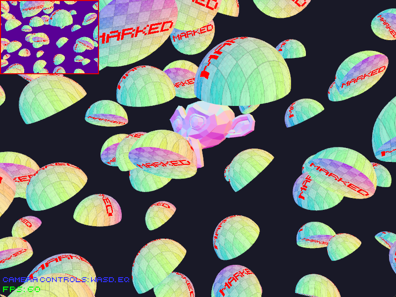

# Wgpu App Base

Scaffolding for creating a general native app using a wgpu renderer.
Rendering logic and window handling are separated from app logic,
allowing for better compartmentalization.

Due to the nature of rust's restrictive type system, it is difficult to implement 
a custom solution for creating updateable uniform buffers in bind groups with dynamic 
allowances for the buffer data type (i.e. f32 array, f32 value, u32 value, custom struct). 

Built-in support for common rendering utilities like MVP matrix, camera control,
MSAA filtering, z-buffer, texture render target, basic shape primitives, and more. 

Note: does not support compiling to wasm for browsers

## Installation

Rust version: 1.76.0

`cargo build`/`cargo run`

### Known Issues:

### To-do:
- Forward render lighting pass
- Shadow rendering
- More primitives
- Physics
- Audio
- Model importing
