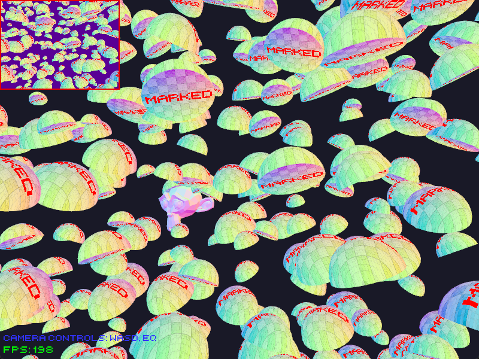

# Wgpu App Base

Scaffolding for creating a general native app using a wgpu renderer.

Rendering logic and window handling are separated from app logic,

allowing for better compartmentalization.

### To-do:
- Fix transformation matrices
- Implement textures
- More primitives
- Custom uniforms for shaders
- Audio
- Model importing

